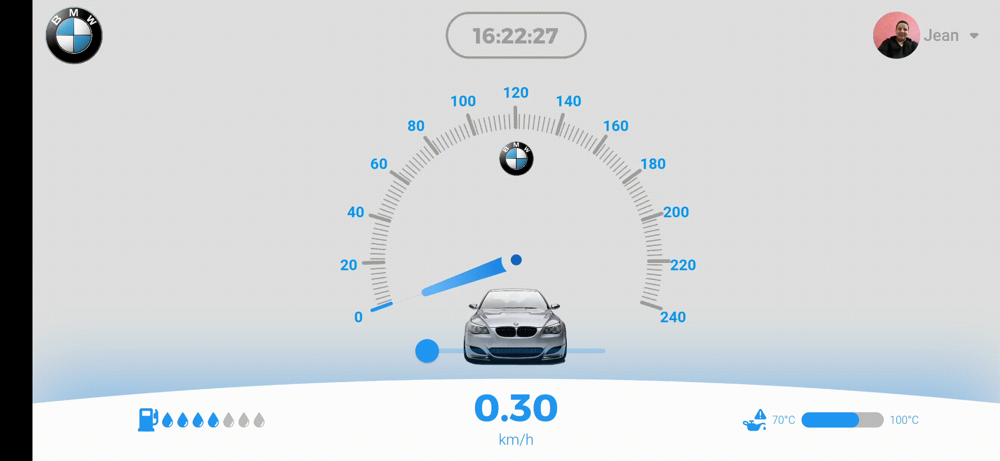
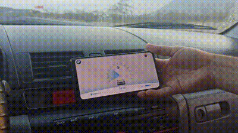

# ======================Challenges======================

## Speedometer web/mobile (Challenge of Flutter Ecuador)

<TABLE border width="600">
    <TR>
        <TH>WEB &#128187;</TH>
    </TR>
	<TR>
		<TD></TD> 
	</TR>
    <TR>
		<TD colspan="2">MOBILE &#128293;&#128241;</TD> 
	</TR>
    <TR>
		<TD></TD> 
	</TR>
    <TR>
		<TD colspan="2">PHYSICAL TEST &#128664;&#128170;</TD> 
	</TR>
    <TR>
        <TD></TD> 
	</TR>
</TABLE>

- [INSPIRATION](https://dribbble.com/frankdesign2012)
- [CREDIT: Frank](https://dribbble.com/frankdesign2012)

## Bank (Challenge of Diego Velasquez)

<TABLE border width="300">
    <TR>
        <TH>Fase 1 &#9997;</TH>
    </TR>
	<TR>
		<TD></TD> 
	</TR>
</TABLE>

- [INSPIRATION](https://dribbble.com/shots/14891203-Banking-Mobile-App)
- [CREDIT: Alex.S](https://dribbble.com/alexey_semenov)
