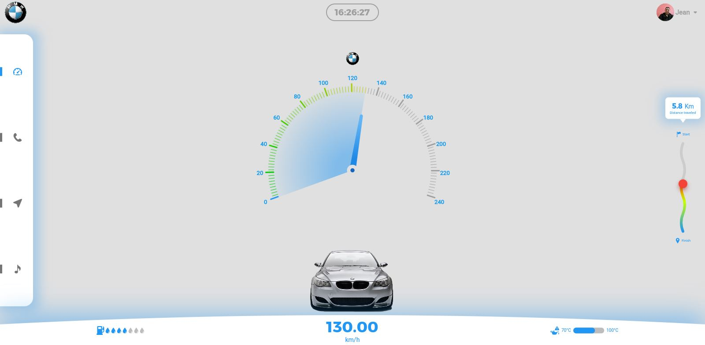
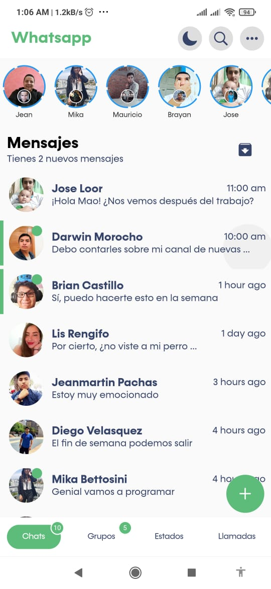
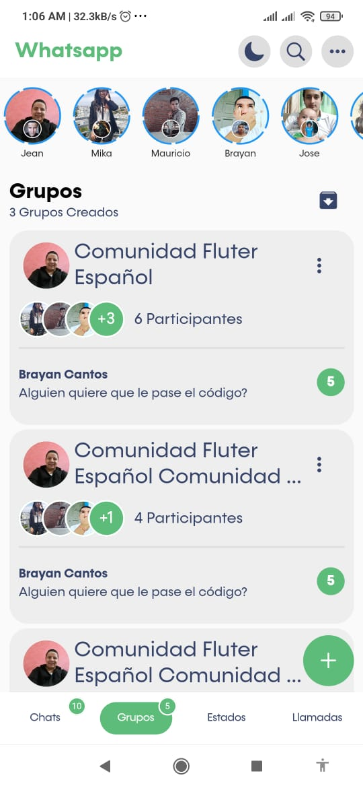
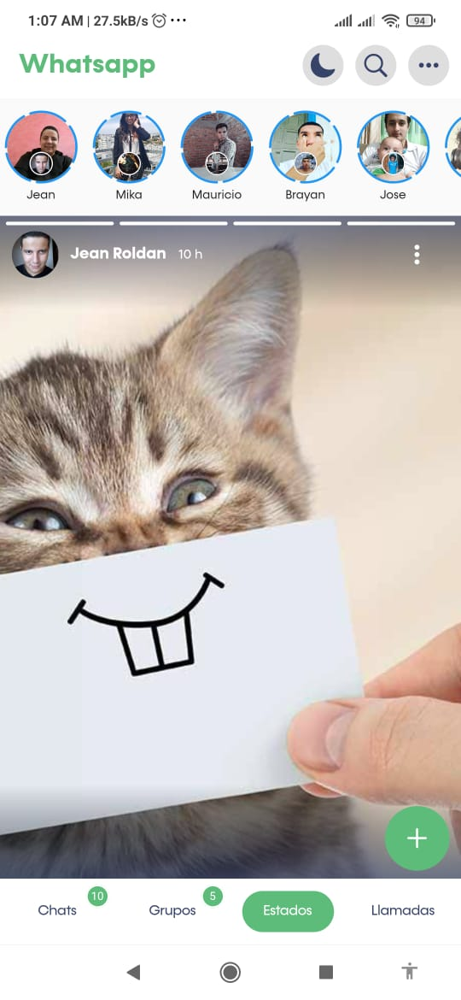
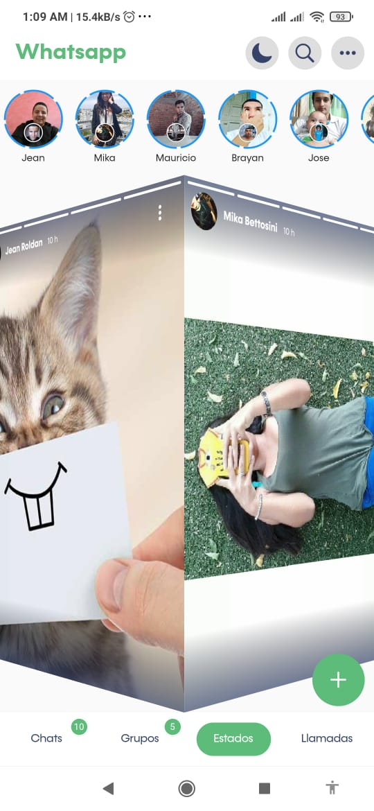
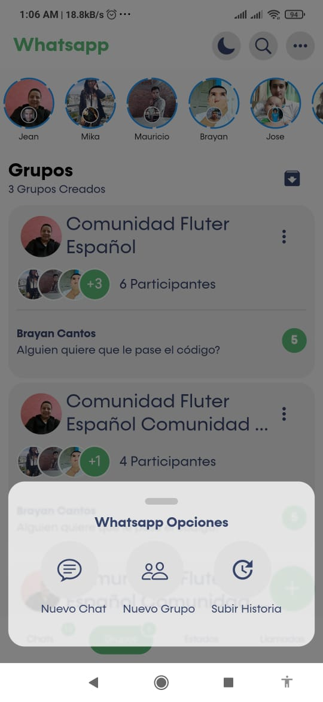
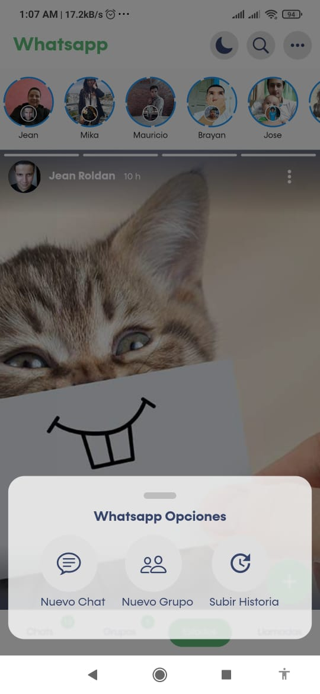
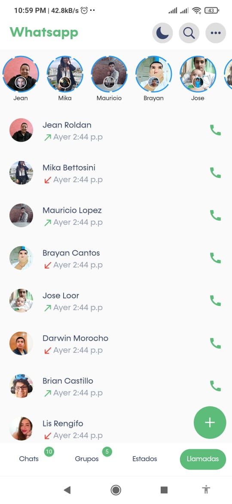

# ===============Challenges===============

## Speedometer web/mobile (Challenge of Flutter Ecuador)

<TABLE border width="600">
    <TR>
        <TH>WEB &#128187;</TH>
    </TR>
	<TR>
		<TD></TD> 
	</TR>
    <TR>
		<TD colspan="2">MOBILE &#128293;&#128241;</TD> 
	</TR>
    <TR>
		<TD></TD> 
	</TR>
    <TR>
		<TD colspan="2">PHYSICAL TEST &#128664;&#128170;</TD> 
	</TR>
    <TR>
        <TD></TD> 
	</TR>
</TABLE>

- [INSPIRATION](https://dribbble.com/frankdesign2012)
- [CREDIT: Frank](https://dribbble.com/frankdesign2012)

## Bank (Challenge of Diego Velasquez)

<TABLE border width="300">
    <TR>
        <TH>Fase 1 &#9997;</TH>
    </TR>
	<TR>
		<TD></TD> 
	</TR>
</TABLE>

- [INSPIRATION](https://dribbble.com/shots/14891203-Banking-Mobile-App)
- [CREDIT: Alex.S](https://dribbble.com/alexey_semenov)

## Whatsapp Redesign Concept

<TABLE border>
    <TR>
        <TH>CHAT &#9997;</TH>
		<TH>GROUPS &#9997;</TH>
    </TR>
	<TR>
		<TD></TD> 
		<TD></TD> 
	</TR>
	<TR>
        <TH>HISTORY &#9997;</TH>
		<TH>HISTORY STEP &#9997;</TH>
    </TR>
	<TR>
		<TD></TD> 
		<TD></TD> 
	</TR>
	<TR>
        <TH>WHATSAPP OPTIONS &#9997;</TH>
		<TH>WHATSAPP OPTIONS &#9997;</TH>
    </TR>
	<TR>
		<TD></TD> 
		<TD></TD> 
	</TR>
	<TR>
        <TH>CALLS &#9997;</TH>
		<TH>FINAL &#9997;</TH>
    </TR>
	<TR>
		<TD></TD> 
		<TD></TD> 
	</TR>
</TABLE>

- [INSPIRATION](https://dribbble.com/shots/15990476-Whatsapp-Redesign-Concept)
- [CREDIT: Mauricio Lopez](https://dribbble.com/m4st3rmiau)
